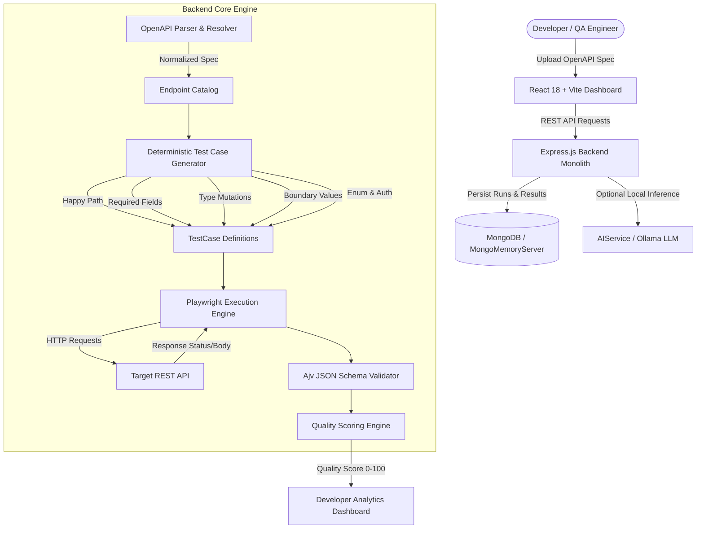

# TestPilot — AI-Powered API Quality Engineering Platform

[](https://nodejs.org/)
[](https://reactjs.org/)
[](https://vitejs.dev/)
[](https://playwright.dev/)
[](https://www.mongodb.com/)
[](https://www.openapis.org/)
[](LICENSE)

> **TestPilot** converts machine-readable **OpenAPI/Swagger 3.x contracts** into **executable functional, negative, type-mutation, boundary-value, enum-constraint, and security test suites**. Executes tests asynchronously via **Playwright's `APIRequestContext`**, validates response contracts strictly using **Ajv**, computes a transparent **Weighted Quality Score (0–100)**, and provides **optional local AI analysis** using Ollama.

---

## 🌟 Executive Summary for Recruiters & Technical Visitors

Unlike standard CRUD projects or simple AI wrappers, **TestPilot is built around a deterministic testing core**. It guarantees 100% test suite generation, contract validation, and execution reproducibility **even when no AI model or external API key is available**.

### Key Engineering Accomplishments
- **Contract-Driven Test Generation**: Generates 20+ test cases per endpoint covering Happy Path, Required Property Omission, Mismatched Data Types, Boundary Limits (`min-1`, `min`, `max+1`), Enum Values, and Protected Auth Headers.
- **High-Performance Execution**: Powered by Playwright's native `APIRequestContext` for non-browser direct HTTP(S) execution with secret masking and timeout safety.
- **Ajv Response Contract Validation**: Validates actual server response bodies strictly against JSON Schemas defined in the OpenAPI spec.
- **Transparent Quality Scoring**: Implements a 6-category weighted quality formula (0–100) instead of black-box AI scores.
- **SSRF & Security-Conscious Design**: Network-level middleware blocking cloud metadata IP ranges (`169.254.169.254`, `metadata.google.internal`) and unauthorized target domains.
- **Zero-Setup Local Execution**: Features dual database connection capability (MongoDB Atlas + embedded `mongodb-memory-server` fallback for instant out-of-the-box local testing).

---

## 🏗️ High-Level System Architecture



---

## 📐 Weighted Quality Score Formula

TestPilot evaluates target API health using a transparent mathematical model:

$$\text{Quality Score} = \sum_{c} w_c \cdot S_c$$

| Category | Weight ($w_c$) | Rationale & Measurement Criteria |
| :--- | :---: | :--- |
| **Functional Coverage** | **30%** | Pass rate of Happy Path requests returning documented success codes (`200`/`201`/`204`). |
| **Contract Validation** | **25%** | Percentage of response payloads strictly conforming to OpenAPI JSON Schemas & headers. |
| **Negative Coverage** | **15%** | Server's ability to reject missing required fields, bad query params, and type mismatches with HTTP `400`. |
| **Boundary Coverage** | **10%** | Server handling of numeric boundaries (`minimum`, `maximum`) and string lengths (`minLength`, `maxLength`). |
| **Security Checks** | **10%** | Rejection rate for unauthenticated requests or malformed Bearer tokens with HTTP `401`. |
| **Execution Success** | **10%** | Pass rate of overall executed tests vs timeouts, network connection drops, or server crashes. |

---

## 🛠️ Technology Stack & Dependencies

### Frontend
- **Framework**: React 18, Vite
- **Styling**: Tailwind CSS (Custom Dark Mode & Glassmorphism Design System)
- **State Management**: Zustand
- **Icons & UI Components**: Lucide Icons, Custom Recharts & Badges
- **HTTP Client**: Axios with JWT Interceptors

### Backend & Engine
- **Runtime**: Node.js LTS, Express.js
- **API Specification**: OpenAPI 3.x, YAML, JSON
- **Test Engine**: `@playwright/test` `APIRequestContext`
- **Schema Validator**: Ajv & Ajv-Formats
- **Database**: MongoDB, Mongoose, embedded `mongodb-memory-server`
- **Authentication**: JWT (`jsonwebtoken`), Password Hashing (`bcryptjs`)
- **Logging & Security**: Pino, Helmet, Rate Limiter, SSRF Protection Middleware

### Target API Fixture
- **Sample API**: Pre-packaged local REST API service (`sample-api` on port 4000) with intentional edge cases for instant platform testing.

---

## 🚀 Quick Start Guide (For Recruiters & Evaluators)

Follow these steps to run TestPilot locally in **under 60 seconds**:

### 1. Prerequisites
- Node.js LTS (v18 or v20+)
- npm (v9+)
- Git

### 2. Clone Repository & Install Dependencies
```bash
git clone https://github.com/your-username/TestPilot.git
cd TestPilot

# Install all monorepo dependencies (root, server, client, sample-api)
npm run install:all
```

### 3. Run Backend Unit Test Suite
```bash
npm test
```
*Executes unit tests for OpenAPI parser, deterministic test generators, Ajv contract validator, and Quality Scoring engine.*

### 4. Start Monorepo Services
```bash
npm run dev
```

This concurrently launches:
- **Client Dashboard**: `http://localhost:5173`
- **Backend API**: `http://localhost:5000`
- **Sample Target REST API**: `http://localhost:4000`

---

## 🎯 60-Second Demo Walkthrough

1. Open **`http://localhost:5173`** in your browser.
2. Click **"Launch instant Demo Workspace"** (logs in automatically with test credentials).
3. Select **Sample E-Commerce API** project (or create a new project with target URL `http://localhost:4000`).
4. Click **Import Spec** $\rightarrow$ Click **"Load Sample E-Commerce Spec"** $\rightarrow$ Click **Validate & Import**.
5. Navigate to **Test Generator & Cases** $\rightarrow$ Click **"Generate Deterministic Tests"** (creates 20+ test cases across 7 categories).
6. Navigate to **Execute Suite** $\rightarrow$ Select Target Environment (`http://localhost:4000`) $\rightarrow$ Click **"RUN TESTS NOW"**.
7. View live progress, inspect failed assertions in the **Result Inspector**, and review the **Quality Score & AI Analysis Report**.

---

## 💡 System Design & Technical Interview Points

### 1. Why OpenAPI contracts instead of Postman collections?
OpenAPI specifications provide formal, machine-readable constraints (data types, minimums, maximums, required properties, enums) from which test suites can be generated deterministically without manual request building.

### 2. Why Playwright APIRequestContext instead of custom fetch/axios?
Playwright's `APIRequestContext` is specifically optimized for automated API testing in Node.js. It manages cookies, keeps contexts isolated, handles custom header overrides cleanly, and integrates natively into automated CI/CD pipelines.

### 3. Why a deterministic engine before AI?
AI models can hallucinate endpoints or fail to reproduce edge cases consistently. TestPilot guarantees reproducible, explainable, contract-based test cases first. AI is layered as an enhancement for failure explanations and recommendations.

### 4. How does TestPilot prevent Server-Side Request Forgery (SSRF)?
Because TestPilot makes outbound HTTP requests to user-specified target servers, `ssrfProtection.js` validates target URLs and blocks access to cloud metadata services (`169.254.169.254`, `metadata.google.internal`) and internal private addresses.

---

## 📁 Repository Folder Structure

```text
TestPilot/
├── client/                      # React 18 + Vite frontend
│   ├── src/
│   │   ├── components/          # Navbar, badges, modals, glassmorphic cards
│   │   ├── pages/               # Dashboard, ProjectDetails, ImportSpec, EndpointExplorer, TestCases, LiveRun, ResultDetails, QualityReport
│   │   ├── services/            # Axios API module with JWT interceptors
│   │   └── stores/              # Zustand authStore & projectStore
│   └── vite.config.js
│
├── server/                      # Node.js + Express backend
│   ├── src/
│   │   ├── config/              # env.js, logger.js (Pino), db.js (Mongoose + MongoMemoryServer)
│   │   ├── controllers/         # Auth, Project, Spec, Test, Run, AI controllers
│   │   ├── middleware/          # JWT Auth, SSRF Protection, Centralized Error Handler
│   │   ├── models/              # Mongoose models (User, Project, ApiSpec, Environment, TestCase, TestRun, TestResult, AIReport)
│   │   ├── services/
│   │   │   ├── openapi/         # Parser, reference resolver, endpoint extractor
│   │   │   ├── generator/       # Happy path, required, type, boundary, enum, auth test generators
│   │   │   ├── runner/          # Playwright APIRequestContext executor
│   │   │   ├── validator/       # Ajv JSON schema contract validator
│   │   │   ├── scoring/         # Quality Scoring Engine
│   │   │   └── ai/              # AIService (Ollama + Fallback provider)
│   │   └── app.js & server.js
│   └── tests/                   # Jest unit test suite
│
├── sample-api/                  # Target REST API fixture for platform validation
│   ├── src/server.js            # Mock REST endpoints (/auth/login, /users, /products)
│   └── openapi/                 # sample-openapi.yaml target contract definition
│
├── docs/                        # Architecture & Security documentation
├── docker-compose.yml           # Docker orchestration
└── README.md                    # Platform documentation
```

---

## 📄 License

Distributed under the **MIT License**. See `LICENSE` for details.

---

<p align="center">
  Developed with ❤️ for Production-Grade API Engineering.
</p>
